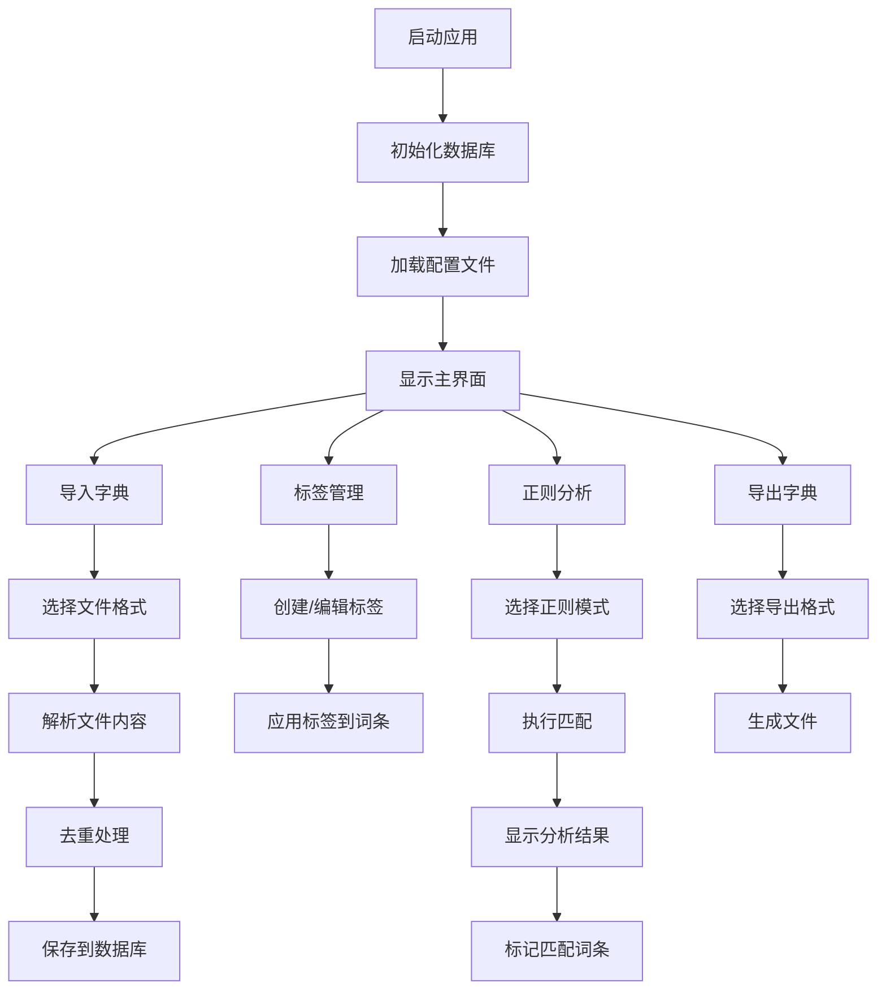

# 字典管理工具架构设计

## 项目概述
基于Python和PyQt6的字典管理工具，支持字典导入、去重、标签管理、正则分析和输出功能。

## 技术栈
- **语言**: Python 3.8+
- **GUI框架**: PyQt6
- **数据库**: SQLite
- **支持格式**: TXT、JSON、CSV

## 项目结构

```
dictionary_tool/
├── main.py                    # 主启动文件
├── config/
│   ├── __init__.py
│   ├── settings.py           # 应用配置
│   └── regex_patterns.json   # 正则表达式配置文件
├── core/
│   ├── __init__.py
│   ├── database.py           # 数据库模型和操作
│   ├── dictionary_manager.py # 字典管理核心功能
│   ├── file_handler.py       # 文件导入导出处理
│   ├── deduplicator.py       # 去重功能
│   ├── tag_manager.py        # 标签管理
│   ├── analyzer.py           # 分析功能
│   └── exporter.py           # 字典输出功能
├── gui/
│   ├── __init__.py
│   ├── main_window.py        # 主窗口
│   ├── dictionary_widget.py  # 字典管理界面
│   ├── tag_widget.py         # 标签管理界面
│   ├── analysis_widget.py    # 分析功能界面
│   └── settings_widget.py    # 设置界面
├── utils/
│   ├── __init__.py
│   ├── regex_helper.py       # 正则表达式辅助工具
│   └── file_utils.py         # 文件操作工具
├── data/
│   └── dictionary.db         # SQLite数据库文件
├── requirements.txt          # 依赖包列表
└── README.md                # 项目说明文档
```

## 核心功能模块设计

### 1. 数据库模型 (database.py)
```python
# 主要表结构：
- dictionaries: 字典表（id, name, description, created_at, updated_at）
- words: 词条表（id, word, dictionary_id, tags, created_at）
- tags: 标签表（id, name, color, description）
- word_tags: 词条标签关联表（word_id, tag_id）
```

### 2. 字典管理 (dictionary_manager.py)
- 创建、删除、重命名字典
- 字典间词条复制和移动
- 字典统计信息

### 3. 文件处理 (file_handler.py)
- 支持TXT、JSON、CSV格式导入
- 自动检测文件编码
- 批量导入处理
- 导出为多种格式

### 4. 去重功能 (deduplicator.py)
- 自动去重：导入时自动检测重复
- 手动去重：用户手动选择去重策略
- 智能去重：基于相似度算法

### 5. 标签管理 (tag_manager.py)
- 标签创建、编辑、删除
- 批量标签操作
- 标签颜色管理
- 标签统计

### 6. 正则分析 (analyzer.py)
- 预设正则模式（CMS、WP、ThinkPHP等）
- 自定义正则表达式
- 批量匹配和标记
- 分析结果导出

## 正则表达式配置系统

### 配置文件结构 (regex_patterns.json)
```json
{
  "preset_patterns": {
    "cms": {
      "name": "CMS相关",
      "patterns": [
        {
          "name": "WordPress路径",
          "pattern": "wp-[a-zA-Z0-9-]+",
          "description": "匹配WordPress相关路径"
        }
      ]
    },
    "security": {
      "name": "安全相关",
      "patterns": [
        {
          "name": "SQL注入",
          "pattern": "(union|select|insert|update|delete)\\s+",
          "description": "匹配SQL注入关键词"
        }
      ]
    }
  },
  "custom_patterns": []
}
```

## GUI界面设计

### 主窗口布局
```
┌─────────────────────────────────────────────────────────┐
│ 菜单栏: 文件 | 编辑 | 工具 | 帮助                          │
├─────────────────────────────────────────────────────────┤
│ 工具栏: [导入] [导出] [去重] [分析] [标签] [设置]           │
├─────────────────────────────────────────────────────────┤
│ ┌─────────────┐ ┌─────────────────────────────────────┐ │
│ │   字典列表   │ │           主工作区域                 │ │
│ │             │ │                                     │ │
│ │ • 字典1     │ │  [标签页1: 字典管理]                │ │
│ │ • 字典2     │ │  [标签页2: 标签管理]                │ │
│ │ • 字典3     │ │  [标签页3: 分析结果]                │ │
│ │             │ │  [标签页4: 设置]                    │ │
│ └─────────────┘ └─────────────────────────────────────┘ │
├─────────────────────────────────────────────────────────┤
│ 状态栏: 当前字典: 字典1 | 词条数: 1000 | 选中: 10         │
└─────────────────────────────────────────────────────────┘
```

## 工作流程图



## 关键特性

### 1. 模块化设计
- 每个功能独立成模块
- 清晰的接口定义
- 便于维护和扩展

### 2. 配置驱动
- 正则表达式外部配置
- 用户设置持久化
- 灵活的自定义选项

### 3. 用户友好
- 直观的GUI界面
- 拖拽操作支持
- 实时反馈和进度显示

### 4. 性能优化
- 大文件分块处理
- 数据库索引优化
- 异步操作支持

## 扩展性考虑

1. **插件系统**: 预留插件接口，支持第三方扩展
2. **API接口**: 提供命令行接口，支持批处理
3. **云同步**: 预留云存储接口
4. **多语言**: 国际化支持框架

这个架构设计确保了代码的可维护性、可扩展性和用户体验的优化。